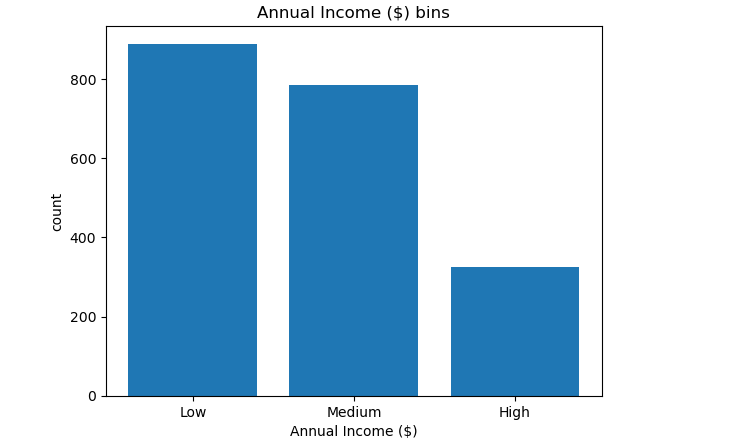

# customer-data-cleaning-pipeline
End-to-end data cleaning workflow: handling missing values, normalization, binning, and indicator variables.
# Customer Data Cleaning & Pre-processing

## 📌 Project Overview
Raw data is rarely ready for analysis. This project demonstrates a comprehensive cleaning pipeline using a messy "Customer Data" dataset to prepare it for machine learning models.

## 🛠️ Data Cleaning Steps
1. **Evaluating Missing Data:** Identifying null values using `.isnull()` and heatmaps.
2. **Fixing Missing Values:** Applying mean/median imputation and frequency-based filling.
3. **Standardize Categories:** Uniforming text data (e.g., converting "USA", "U.S.", and "us" to "United States").
4. **Correcting Data Formats:** Ensuring dates and numerical strings are converted to proper `datetime` and `float` types.
5. **Data Normalization:** Scaling numerical features (like Age or Annual Income) to a range of [0, 1] for better model performance.
6. **Binning:** Segmenting continuous data into groups (e.g., grouping "Annual Income" into "Low", "Medium", and "High").
7. **Bin Visualization:** Visualizing the distribution of these new segments using histograms.
8. **Indicator Variables:** Transforming categorical variables into "Dummy Variables" (One-Hot Encoding) for algorithmic compatibility.

## 🚀 How to Use
1. Clone the repo: `git clone https://github.com/YOUR_USERNAME/customer-data-cleaning-pipeline.git`
2. Install dependencies: `pip install -r requirements.txt`
3. Run `cleaning_process.ipynb` to see the transformation from raw to clean data.

## 📊 Visual Highlight

*Example of step 7: Visualizing the binned 'Customer Annual Income' segments.*
.ipynb)
